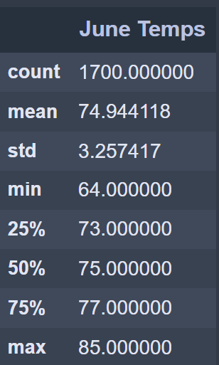
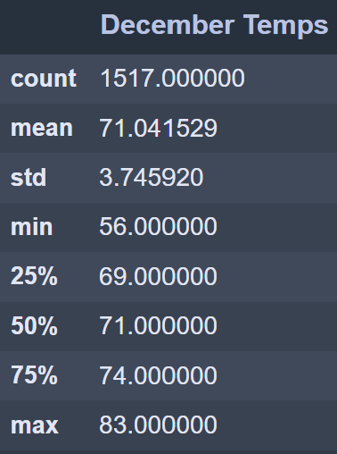

# Surfs_Up
 
## Overview of Oahu Temperature Analysis:

Mr. Avy is interested in opening a surf & ice cream shop in Oahu and wants to know if it will be profitable. While this analysis cannot make any claims as to profitablility, it will provide insight on the general temperatures in the area the shop would be.

## Results

### Raw results:
______

### Results analysis:
- On average, the temperature is lower in December than in June, but only by about 4 degrees F.
- Max temperatures differ by only 2 degrees, but min temperatures differ by 8.
  - Since the standard deviation for June is noticeably less than in December, but their averages are fairly close, this is likely due to some outliers.
- There are 200 more data points for June than December which minimally impacts the averages unless there's a reason for the distinct lack of ~ 6 months worth of data in December.
- 

## Summary:
Since the average temperature for June and December are both above 70 degrees F, that should provide sufficient heat for ice cream and surfing. Further investigation into the difference in the number of data points might be worth it to see if somehow weather impacts data collection in December which could skew the data. Additional queries that might aid in your decision might include expanding the results to include each month and including average preciptation for each month as well.
